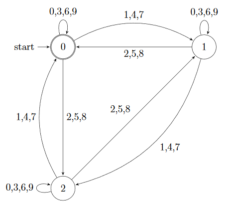
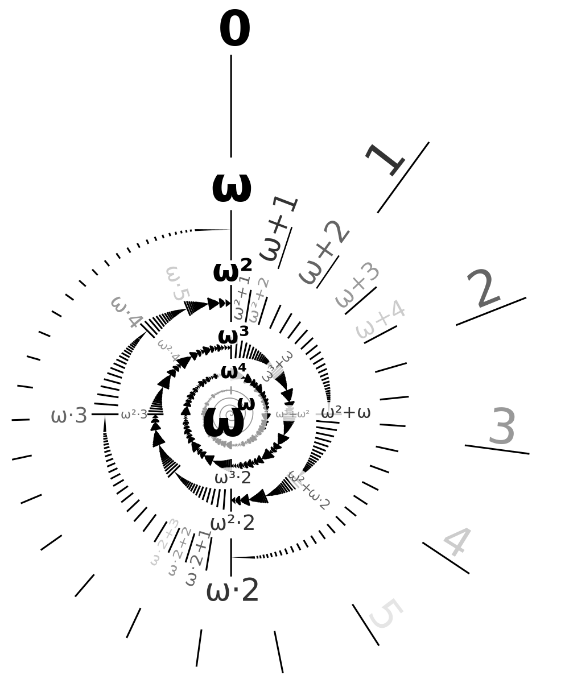

---
title: Semiautomatic Ordinal and Ring Structures
author: Qi Ji
institute: NUS School of Computing
date: 13th November 2019
theme: Madrid
fontsize: 12pt
header-includes:
- '\newcommand{\textsmall}[1]{{\small #1}}'
- '\usepackage{qrcode}'
- '\graphicspath{{CP3208/}}'
...

### Slides

\newcommand{\N}{\mathbb{N}}
\newcommand{\Z}{\mathbb{Z}}

<https://m4th.b0ss.net/semi/semi.pdf>

\qrcode[height=10em]{https://m4th.b0ss.net/semi/semi.pdf}

# Background

## Automata theory

### Finite automata

* Processes input symbol by symbol with finite memory

* The finite memory indicates whether the word as seen so far satisfies the condition to be checked.

### Check multiple of 3

{height=80%}

### Automatic relations

* Encode idea of process tuples in parallel

* Add a padding symbol \(\#\)

* \(conv(010, 01236) = \binom{0}{0}\binom{1}{1}\binom{0}{2}\binom{\#}3\binom{\#}6\)

* A function is automatic iff its graph (encoded this way) is automatic

### Verifying addition

Primary school algorithm

* `n` -- correct and no carry

* `c` -- carry

* `i` -- wrong

```
Correct addition    Incorrect addition
      2 3 5 8            3 3 3 3
      # 1 1 2            # # 2 2
      2 4 7 0            # 1 5 5
     n n n c n          i i n n n
```

### Automatic structures

A structure \((A, f_1,\dots,f_n, R_1,\dots,R_m)\) is **automatic** iff

* \(A\) is a regular set,

* \(f_1,\dots,f_n\) are automatic functions,

* \(R_1,\dots,R_m\) are automatic relations.

##### Example

\((\mathbb{N}, +)\) is automatic but
\((\mathbb{N}, +, \cdot)\) is not automatic.

### Semiautomatic structures

\((A, f_1,\dots,f_n, R_1,\dots,R_m;g_1,\dots,g_p,S_1,\dots,S_q)\) is **semiautomatic** iff

* \(A\) is a regular set,

* \(f_1,\dots,f_n\) are automatic functions and \(R_1,\dots,R_m\) are automatic relations,

* \(g_1,\dots,g_n\) are semiautomatic functions and \(S_1,\dots,S_m\) are semiautomatic relations,

where \(f: A^n \to A\) is semiautomatic iff fixing \(n-1\) inputs, the resultant \(A\to A\) function is automatic.

### Semiautomatic structures

##### Example

\((\mathbb{N}, +, <, =; \cdot)\) is not automatic.

For any constant \(n\), implement multiplication by \(n\) as repeated addition.

## Set theory

### Ordinals

Equivalence classes of well-order, where a well-order \((S, <)\) obeys
trichotomy, transitivity and well-foundedness (every nonempty subset has a minimum).

Intuitively, measures how many times a discrete process is repeated (possibly transfinitely many).
For example,
\(0,1,2,3,\dots,\omega,\omega+1,\dots,\omega + \omega = \omega\cdot 2,\) 
\(\omega\cdot2+1,\omega\cdot2+2,\dots,\omega\cdot2 + \omega = \omega\cdot3, \dots, \omega\cdot4,\dots\),
\(\omega\cdot\omega = \omega^2, \dots, \omega^3,\dots, \omega^\omega,\dots\).

One way to generalise sum and products to infinite structures.

### Ordinals

[{height=85%}](https://upload.wikimedia.org/wikipedia/commons/e/e6/Omega-exp-omega-labeled.svg)

# Semiautomatic Ordinal Structures

## Semiautomatic ordinals with automatic addition

### Existing characterisation

##### Theorem (Delhommé)

For any ordinal \(\alpha\) the structure \((\alpha, +, <)\) is automatic iff \(\alpha<\omega^\omega\).

##### Proof Sketch

Consider \(\alpha = \omega^n\), any \(\beta \in \alpha\) is of the form
\[\omega^{n-1}\cdot c_{n-1} + \dots + \omega\cdot c_1 + c_0\]
for coefficients \(c_0,\dots,c_{n-1}\in\mathbb{N}\).

We can define \(+\) on the \(n\)-ary convolution of an automatic copy of \((\mathbb{N}, +, <)\).

### Incorporating semiautomaticity

**Observation.**
Using the same representation, when \(\beta \in \alpha\) is fixed, we can define
left and right-multiplication by \(\beta\) in an automatic manner.
(Addition and multiplication on ordinals are not commutative)

##### Theorem

For any ordinal \(\alpha < \omega^\omega\) the structure \((\alpha, +, <, =;\cdot)\) is semiautomatic.

### Left multiplication

Let
\begin{align*}
    \beta  &= \omega^k\cdot b_k + \omega^{k-1}\cdot b_{k-1} + \dots + \omega\cdot b_1 + b_0 \\
    \gamma &= \omega^l\cdot c_l + \omega^{l-1}\cdot c_{l-1} + \dots + \omega\cdot c_1 + c_0
\end{align*}
expanding the giant expression, we get
\begin{align*}
    \beta\cdot\gamma &= \beta\cdot\omega^l\cdot c_l + \beta\cdot\omega^{l-1}\cdot c_{l-1} + \dots + \beta\cdot\omega\cdot c_1 + \beta\cdot c_0 \\
&\dots \\
    &= \omega^{k+l}\cdot c_l + \omega^{k+l-1}\cdot c_{l-1} + \dots + \omega^{k+1}\cdot c_1 \\
    &\quad + \left(\omega^k\cdot (b_k\cdot c_0) + \omega^{k-1}\cdot b_{k-1} + \dots + \omega^{b_1} + b_0\right)\cdot 1_{c_0 \ne 0}
\end{align*}
where \(1_{c_0 \ne 0}\) is \(1\) is \(c_0 \ne 0\) and \(0\) otherwise.


### Right multiplication

Ordinal multiplication distributes on the right, so we get a finite composition of

* right-multiplication by \(\omega\),

* right-multiplication by fixed constants,

* ordinal addition.

### Right multiplication by \(\omega\)

\begin{align*}
&\left(\omega^3\cdot b_3 + \omega^2\cdot b_2 + \omega \cdot b_1 + b_0\right)\cdot\omega \\
&= \begin{cases}
    \omega^4 &\text{if } b_3 > 0 \\
    \omega^3 &\text{if } b_3=0, b_2>0 \\
    \omega^2 &\text{if } b_3=0, b_2=0, b_1>0 \\
    \omega &\text{if } b_3=0, b_2=0, b_1=0, b_0>0 \\
    0 &\text{otherwise}
\end{cases}
\end{align*}

## Semiautomatic ordinals at \(\omega^\omega\) and beyond

### Overview

##### Theorems (Jain, Khoussainov, Stephan, Teng and Zou)

* Let \(\alpha\) be any countable ordinal, the structure \((\omega^\alpha; +, <, =)\) is semiautomatic.

* The semiring of polynomials over \(\mathbb{N}\) \((\mathbb{N}[x];+,\cdot,=)\) is semiautomatic.

### Polynomials over \(\mathbb{N}\)

* Fix an semiautomatic copy \(A\) of \((\mathbb{N},+,<;\cdot)\), add new "connectives" \(\oplus, \otimes\)

* Represent polynomials as lists of coefficients from \(A\)

* Represent elements as polynomials with connectives between them

    - \(1,10,2\oplus 0,4\) represents the expression \((2x^2 + 10x + 1) \cdot (4x)\)

* Define the quotient map \(val\) sending an expression to the canonical representation.

* \(val\) is not automatic, but for any polynomial \(p\in \mathbb{N}[x]\), there is an automatic fragment of \(val\) that is "good enough".

### Polynomials over \(\omega\)

* We need even more connectives \(\oplus_l, \oplus_r, \otimes_l, \otimes_r\)

* For arbitrarily large \(k\in\mathbb{N}\), \(k + \omega = \omega\) and \(\omega\cdot k\cdot\omega = \omega\cdot\omega\)

* Refine error conditions to deal with this

##### Conclusion

The structure \((\omega^\omega;+,<,\cdot,=)\) is semiautomatic.


# Semiautomatic Ring Structures

### Overview

Rings are obtained by adding to an Abelian group a notion of multiplication.

##### Theorem (Jain, Khoussainov, Stephan, Teng and Zou)

For any \(n\in\N\) the ring \((\Z(\sqrt{n}), \Z, +, <, =; \cdot)\) is semiautomatic.

### Illustrating square roots

We illustrate with the simplest case, let \(u = \dfrac{1+\sqrt{5}}2\) denote the golden ratio.

##### Theorem (Jain, Khoussainov, Stephan, Teng and Zou)

\((\Z[u], +, <, =;\cdot)\) is semiautomatic.

### The ingredients

* \(3 = u^{-2} + u^2\) for any \(x + yu \in \Z[u]\), so update coefficients until \[x + yu = \sum_i a_i u^i\] but now each \(|a_i| \leq 2\).

* Tail bound -- \(\sum_{i\leq 2} u^i\) is a geometric series

### Sign test

* To check if \(a + b = c\) we perform sign test on \(a + b - c\).

* Given a list of coefficients, we slide over them and use the equation \(u^2 = u + 1\) to update our memory

* The first time any coefficient overshoot \(4\cdot\sum_{i\leq2} u^i\), by our earlier tail bound we will know the sign

* If all input is processed, do a finite case distinction

* Use the characterisation that automatic functions are also computable by linear-time one-tape Turing machines where input and output start at the same position (Case, Jain, Seah and Stephan) to look through coefficients in order.

## Generalising to cube roots

### The case of \(\sqrt[3]{7}\)

Let \(u^{-1} = 2 - \sqrt[3]{7}\) and we use a similar strategy to show \((\Z[u], +, <, =;\cdot)\) is semiautomatic.

* To achieve our coefficient bound we have
\[ u^3 - 12u^2 + 6u - 1 = 0 \]
where \(12\) dominates.

* The tail bound is also geometric, but since we update two coefficients at once in every step of the sign test,
we need more refined bounds.

### The case of \(\sqrt[3]{7}\)

* Denote our current coefficients \(a_i, a_{i+1}, a_{i+2}\) and we terminate if any condition here is broken

    - \(|a_{i+2}| \leq 16k'\),

    - \(|a_{i+1}| \leq 4k'\), or

    - \(|a_{i}| \leq k'\), or

  where \(k' = 360\).

This gives us a semiautomatic ring containing \(\sqrt[3]{7}\).

# Conclusion

### Contributions

* Incorporate notion of semiautomaticity into small ordinals (below \(\omega^\omega\)).

* Found semiautomatic rings containing cube roots, generalising existing result.

### Future directions

On ordinals

##### Question

For how large \(\alpha\) can we find semiautomatic representations of \((\alpha;+,<,\cdot,=)\)?

### Future directions

On semiautomatic rings

##### Question

For every algebraic number \(c\) is there a semiautomatic ring with order which contains \(c\)?

##### Question

Is there a semiautomatic ring with order that simultaneously contains \(\sqrt{2},\sqrt{3}\) and \(\frac12\)?

When these 3 numbers are simultaneously present, the ring has enough information to encode the angle \(15\) degrees.
