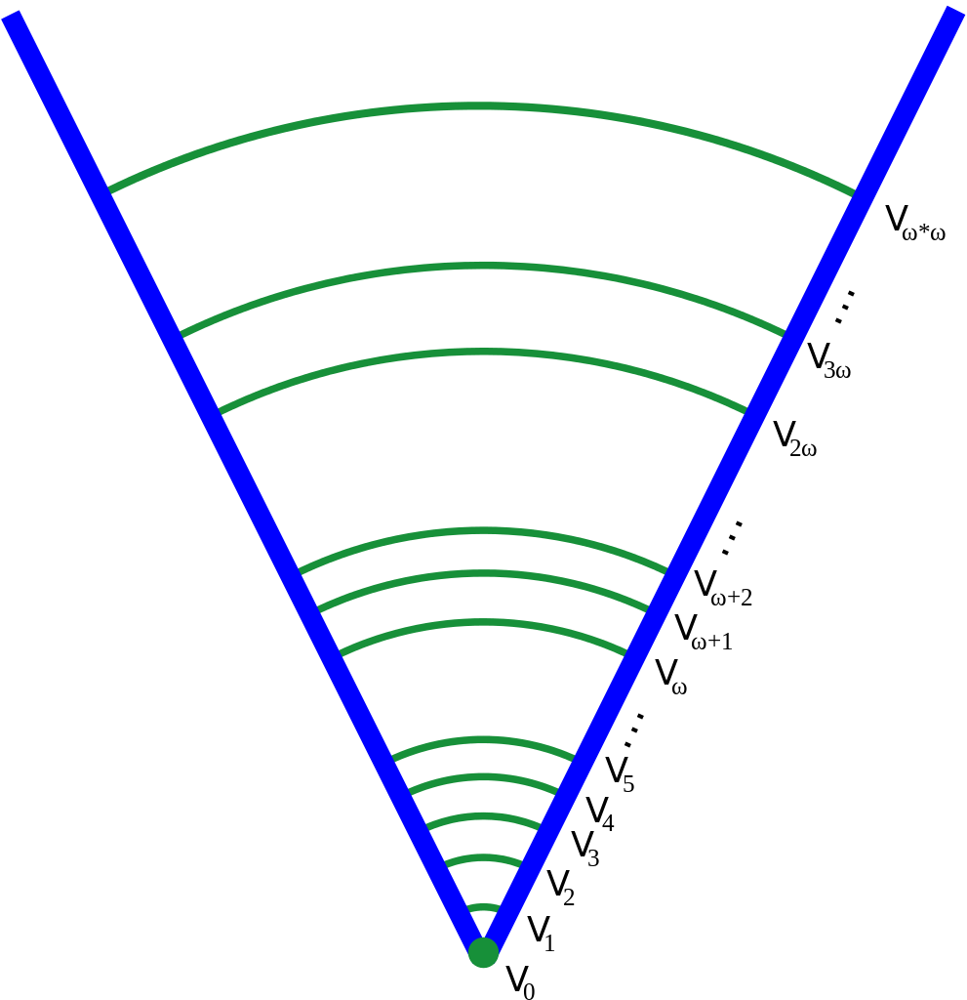

## Slides

\let\phi\varphi

<https://m5th.b0ss.net/MA4199/slides-intro.pdf>

\qrcode[height=10em]{https://m5th.b0ss.net/MA4199/slides-intro.pdf}

# Basic concepts

## ZFC axioms

0. Existence \[ \exists x \left( x = x \right). \]
1. Extensionality \[ \forall x \forall y \left( \forall z\left(z\in x\leftrightarrow z\in y\right) \rightarrow x = y \right). \]
2. Foundation \[ \forall x \sq{ \exists y \paren{y\in x} \to \exists y \paren{y\in x\land \lnot\exists z\paren{z\in x\land x\in y}} } .\]
3. Comprehension Scheme. For each formula \(\phi\) with free variables \(x,z,w_1,\dots,w_n\), \[ \forall z \forall w_1,\dots,w_n\ \exists y\ \forall x\paren{x\in y\leftrightarrow x\in z\land \phi}. \]

## ZFC axioms

4. Pairing. \[\forall x\ \forall y\ \exists z\paren{x\in z\land y\in z}.\]
5. Union. \[\forall\mathcal{F}\ \exists A\ \forall Y\ \exists x\paren{x\in Y\land Y\in\mathcal{F}\to x\in A}. \]
6. Replacement Scheme. For each formula \(\phi\) with free variables \(x,y,A,w_1,\dots,w_n\), \[ \forall A\ \forall w_1,\dots,w_n \sq{\forall x\in A\ \exists! y\ \phi \to \exists Y\ \forall x\in A\ \exists y\in Y\ \phi} .\]
7. Infinity. \[\exists x\paren{0\in x\land \forall y\in x\paren{y\cup\set{y} \in x}}. \]
8. Power Set. \[\forall x\ \exists y\ \forall z\paren{z\subseteq x\to z\in y}.\]

## Choice

\[ \forall A\ \exists R \paren{R \text{ well-orders } A}. \]

## Sets and classes

Every object in our universe is a set, and sets can only contain sets (foundation).

> This is not to say that we are denying the existence of human beings. We are just refraining from considering all
real world objects because they do not play any role in mathematics.

Given a formula \(\phi(x)\) we can define a class \[ \mathbf{A} = \set{x: \phi(x)} \]
such that \(x\in\mathbf{A}\) is syntactical shorthand for \(\phi(x)\).

## Ordinals

{height=80%}

## von Neumann hierarchy

Recursively define

* \(V_0 = 0\).

* \(V_{\alpha+1} = \mathcal{P}(V_\alpha)\).

* \(V_\gamma = \bigcup_{\alpha<\gamma} V_\alpha\) when \(\gamma\) is a limit.

Universe
\[\mathbf{V} = \bigcup_{\alpha\in\mathbf{ORD}} V_\alpha. \]

## 

# Introduction to independence

## Example -- Non-Euclidean geometry.

For thousands of years people tried to prove [Parallel Postulate](https://en.wikibooks.org/wiki/Geometry/Five_Postulates_of_Euclidean_Geometry) from [Euclid's first four postulates](https://en.wikibooks.org/wiki/Geometry/Five_Postulates_of_Euclidean_Geometry).

Impossible!

* flat plane models all 5 of Euclid postulates

* surface of a sphere is non-Euclidian, violates Parallel postulate

## Easy informal independence proof

Assume consistency of ZF,
\[ V_\omega = \set{\text{all finite sets}} \] is a model of ZF - infinity + "all sets are finite".

**Conclusion.**
Infinity is not provable from the other axioms of ZFC, there is a model in which it fails.

# Independence of choice

## Fraenkel-Mostowski model (1922)

Give up on foundation, so our universe \(\V\) satisfies ZF except foundation.

Members of our universe \(\V\) are either sets or "atoms", let \(A\) be the infinite set of all atoms (a universe with this many atoms exist).

Consider \(G\) the group of permutations on the atoms \(A\).
Naturally extend every \(\pi\in G\) into an automorphism \(\pi_*: \V\to\V\) by

* \(\pi_*(x) = \pi(x)\) for atomic \(x\in A\),
* \(\pi_*(y) = \set{\pi_*(z): z\in y}\) otherwise.

(formally this is defined by recursion on rank of objects)

## Fraenkel-Mostowski model (1922)

\newcommand{\trcl}{\operatorname{trcl}}

For each \(B\subseteq A\), consider the stabilizer
\[ G_B = \set{\pi\in G: \forall x\in B\paren{\pi(x) = x}}. \]

Call \(y\) symmetric if there exists finite \(B\subseteq A\)
such that for all permutations \(\pi\in G_B\), \(\pi_*\) fixes \(y\).
Let \(\mathbf{S}\) denote all symmetric objects.

Let \(\mathbf{HS} = \set{y\in\mathbf{S}: \trcl(y)\subseteq \mathbf{S} }\) denote the class of hereditarily symmetric objects.
This is the **basic Fraenkel model**.

Check: \(\mathbf{HS}\) satisfies all axioms of ZF except foundation.

## Failure of choice in basic Fraenkel model

**Observation.** \(A \in \mathbf{HS}\).

**Claim.** \(A\) cannot be ordered within \(\mathbf{HS}\).

Suppose not, work in \(\mathbf{HS}\) and let \(R\) be a linear order on \(A\).

As \(R\in\mathbf{HS}\) there is a finite \(B\) such that
all permutations \(\pi\in G_B\) satisfies \(\pi_*(R) = R\).

Now compute
\[ \pi_*((x,y)) = \set{\set{\pi(x)},\set{\pi(x),\pi(y)}} = (\pi(x),\pi(y)), \]
\[ \pi_*(R) = \set{\pi_*((x,y)): x R y} = \set{(\pi(x),\pi(y)): x R y}. \]

Computations show that for all \(x,y\in A\), we have \(x R y\) iff \(\pi(x) R \pi(y)\).
Contradiction because \(\pi\) in general can invert the order for \(x,y\notin B\).

## Next steps

Basic Cohen model

* analogue of F-M model but we keep foundation,
* \(\mathbb{R}\) cannot be well-ordered,
* permute forcing names instead of atoms.

Second Cohen model

* countable choice fails.

Solovay model

* every set of real is Lesbegue measurable.

# Thank you
